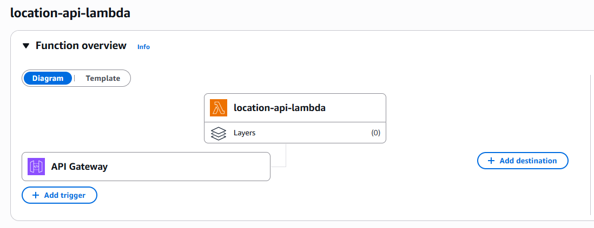

# Locations API

This project provides a secure serverless API for accessing location data, powered by AWS Lambda and 
API Gateway.
Infrastructure is managed using **Terraform**.


## Overview

[Trip planner web app](https://github.com/lrasata/trip-planner-web-app) is using [Geo DB API](https://rapidapi.com/wirefreethought/api/geodb-cities)
to fetch data related to cities and countries.

To be able to deploy [Trip planner web app](https://github.com/lrasata/trip-planner-web-app)
(React + TypeScript web app) securely on S3 + CloudFront, it must provide a secret `API_KEY` in the header of an authenticated request.

But the challenge is, to inject secrets securely in a React + Vite app, secrets must be separated from
the frontend and a backend must be used to access them. **There is no secure way to keep a secret in a public browser app.**

Locations API has been created to provide an API endpoint to call for the frontend without requiring any secrets. Those components provide a secure serverless API for accessing location data, powered by AWS Lambda and API Gateway.



## Key attributes
**Security**
- Secrets like API keys are stored in AWS Secrets Manager and passed to Lambda via environment variables, preventing exposure in the frontend.
- No sensitive data is ever stored in the browser or client code.

**Maintainability**
- Usage of serverless architecture (AWS Lambda) to avoid managing servers, making deployments and updates easier.
- Node.js runtime and Express-style Lambda code structure to simplify development and debugging.

**Scalability**
- Lambda functions automatically scale based on incoming request volume.
- API Gateway handles request routing and can throttle.

**Reliability**
- Managed AWS services like Lambda and API Gateway provide built-in high availability.
- Error handling and CORS headers are implemented to prevent client-side failures.

**Monitoring**
- **AWS CloudWatch Alarms + SNS** are set up to monitor :
    - Api gateway :
        - Alert when API Gateway 5xx errors spike
        - Alert when API Gateway latency is high
    - Lambda function :
        - Alert when Lambda has errors

## Env variables and secret API key

**Local development**

In `modules/locations_api/lambda/index.js`, the secret (e.g., API key) should be passed via environment variables in Terraform:

```js
Authorization: 'Bearer ${process.env.GEO_DB_RAPID_API_KEY}'
```

List of env variables :
````text
API_CITIES_GEO_DB_URL=
API_COUNTRIES_GEO_DB_URL=
GEO_DB_RAPID_API_HOST=
GEO_DB_RAPID_API_KEY=
````

**For deployed env on AWS**

Secrets have to be defined in AWS Secrets Manager inside : `<environment>/trip-planner-app/secrets` as configure in Terraform file.

Environment variables have to be defined in `terraform.tfvars`

## API Usage

### GET `/locations?dataType=city&namePrefix=Paris`

Query parameters :
- **dataType**: `city` or `country`
- **namePrefix**: the `string` to look up to perform matching on location name
- **countryCode**: country code

```bash
curl https://<your-api-id>.execute-api.<region>.amazonaws.com/prod/locations?dataType=city&namePrefix=Paris
```

## 🔎 Gotchas - Lessons learned
- OPTIONS method should stay with *CORS headers* in API Gateway.
    - API Gateway can automatically respond to preflight OPTIONS requests (which browsers send to check permissions) without invoking your Lambda — this reduces Lambda invocations and saves cost.
- For GET requests (or any non-OPTIONS request), Lambda function MUST return the CORS headers.
- No need to set CORS headers on API Gateway for GET/POST when using `Lambda proxy integration`.
    - But ensure your Lambda function handles CORS headers for all responses (including errors).

> 💡 Let API Gateway manage CORS whenever possible — Keep Lambda code simpler and focused on business logic.
>
> API Gateway is designed to handle cross-origin resource sharing (CORS) settings centrally.
